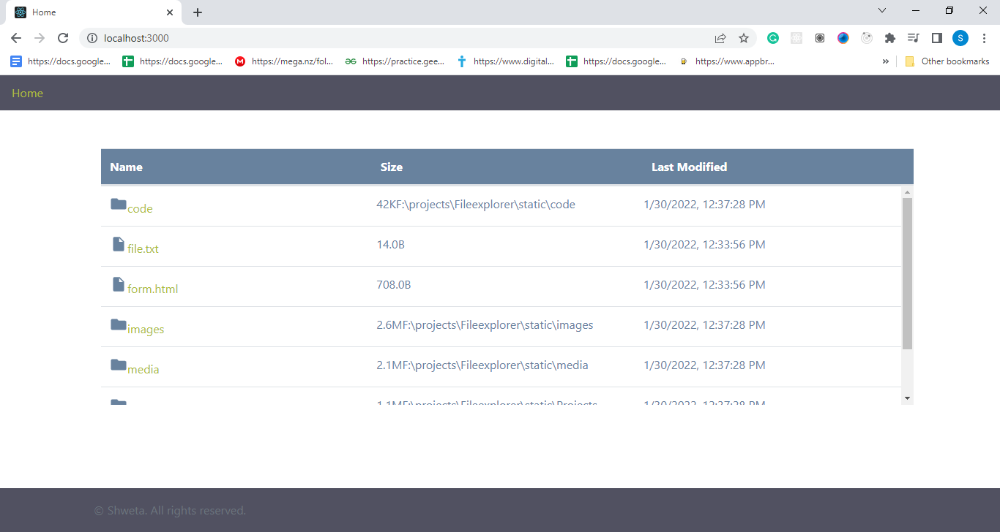

# NodeExplorer

### Table of Contents

- [Description](#description)
- [Technologies](#technologies)
- [How To Use](#how-to-use)
- [License](#license)
- [Author](#author)

---

## Description
This is a pure nodejs app and by pure I mean no modules of nodejs is used in
here.
This explorer can keep track of every file you want and can sort them according
to the alphabets used in file name, according to the size of the file and at last
according to the last modified date. 
#### Technologies

- Html
- CSS
- Javasrcipt
- Nodejs

[Back To The Top](#read-me-template)

## How To Use

#### Installation

First download the project using zip file then open it in any code editor you want like vscode, atom.
After that open the gitbash/hyper in the path of downloaded folder after extracting the zip
then initiate the node by the command

<b>npm init</b>

then install node module using command 

<b>npm i node</b>

then you can install nodemon by the command

<b>npm i nodemon</b>

then run node app.js in hyper.
then type nodemon in the git bash/hyper.

After that at type "localhost:3000" in the the browser 

and bingo My project is ready to serve.

[Back To The Top](#read-me-template)

## License

Copyright (c) [2021] [Shweta Mehta]

Permission is hereby granted, free of charge, to any person obtaining a copy
of this software and associated documentation files (the "Software"), to deal
in the Software without restriction, including without limitation the rights
to use, copy, modify, merge, publish, distribute, sublicense, and/or sell
copies of the Software, and to permit persons to whom the Software is
furnished to do so, subject to the following conditions:

The above copyright notice and this permission notice shall be included in all
copies or substantial portions of the Software.

## Author 
- - [Shweta mehta](https://github.com/shweta588)
